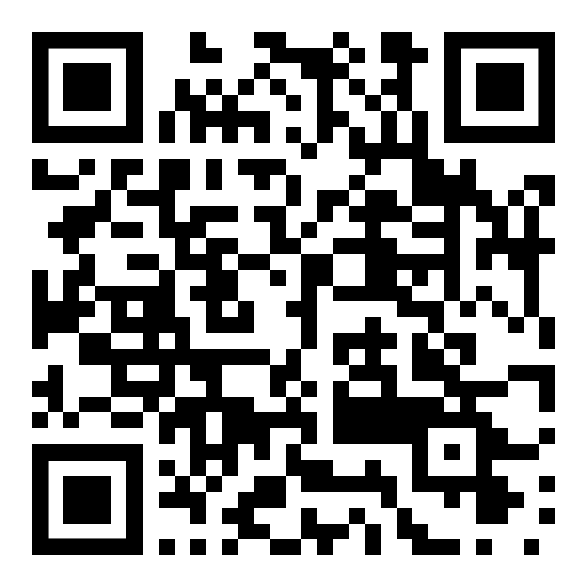
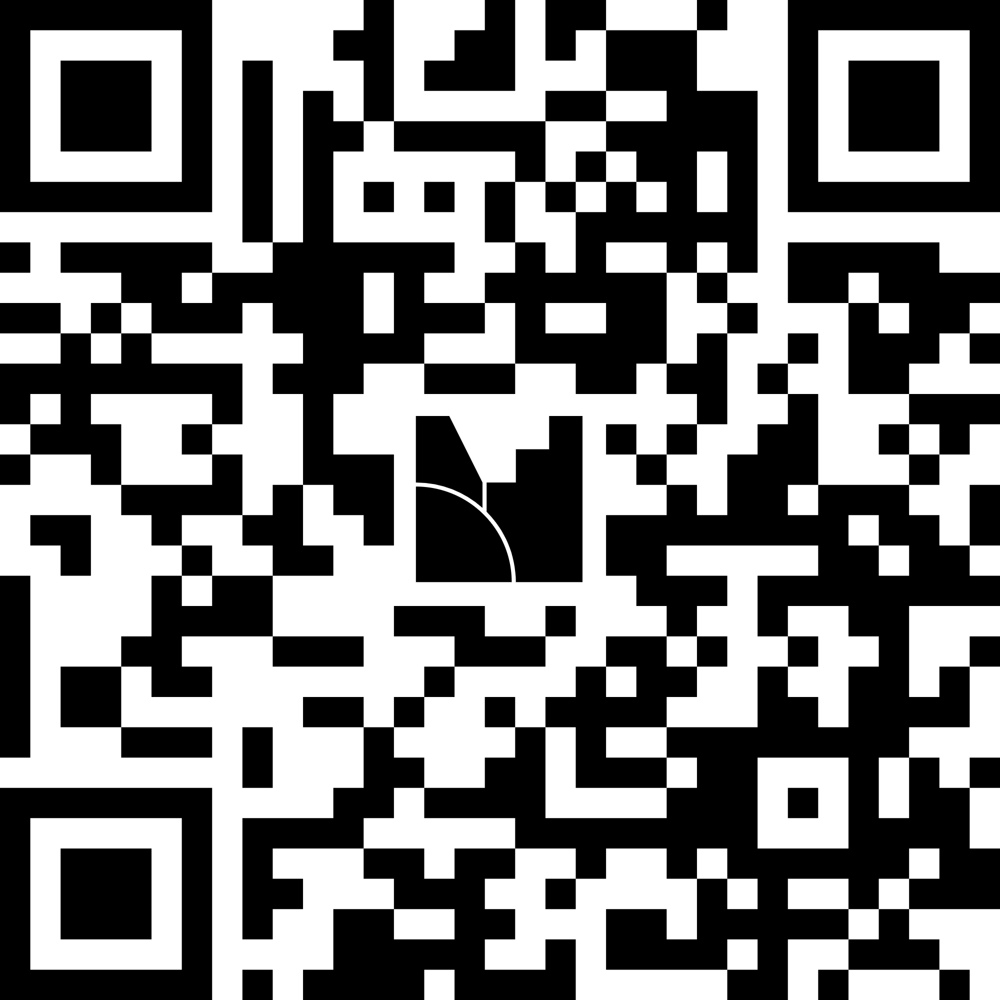

---
format:
  revealjs:
    output-file: 00-intro-slides.html
    incremental: true
---

# Organisational aspects

## Introduction

:::: {.columns}

::: {.column width="55%"}

::: {.fragment}
+ **Where:**
    - English Park - Geijer lecture hall
+ **When:**
    - Monday, August 17, 13:00 - 16:00
+ **Instructors:**
    - Aki Vehtari
    - Steve Bronder
    - Brian Ward
    - Florence Bockting
:::

:::

::: {.column width="45%"}

::: {.fragment}
+ **Material:**
    - Online book + PDF
    - [florence-bockting.github.io/stancon-contributing](https://florence-bockting.github.io/stancon-contributing/)

::: {.fragment}
{fig-alt="QR code linking to the tutorial material" width="45%" fig-align="center" .nostretch}
:::
:::

:::

::::

::: {.fragment}
### Extra: Hackathon on Friday
:::

## Introduction: Your Turn!

Please open the following link to a [mentimeter poll](https://www.menti.com/alt3e2mhmcbs).

{fig-alt="QR code linking to stancon-contributing poll" width="30%" fig-align="center" .nostretch}

## Collaborative notes {.unnumbered}

During the session we keep a [shared notepad](https://hackmd.io/@EVsglo65Sp-6aWs8tjqS7A/ByZOpDO8Mx/edit). 
You can add questions, comments, and links for sharing with others there. 
No account needed, just open the link and start typing.

{fig-alt="QR code linking to the shared HackMD notepad" width="30%" fig-align="center" .nostretch}

Of course you can also...

## ... contact us

- during the tutorial session and the entire week
- or reach us later via e-mail, GitHub, Slack, Stan Discourse

## Contents

1. What is Stan?
2. The Stan ecosystem
3. How to contribute to Stan?
4. Where to find information?
5. Open Discussion/Question Round