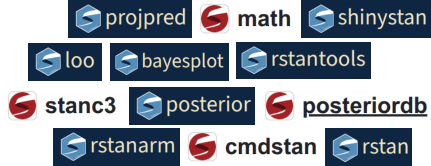

---
format:
  revealjs:
    output-file: 01-what-is-stan-slides.html
    incremental: true
---

# What is Stan?

By the end of this section, you'll understand that Stan is a 
probabilistic programming language for specifying statistical models, 
an open-source community, as well as a broader software ecosystem.

---

## Language, Community, Ecosystem

Stan is ...

- an [open-source community](#sec-open-source-community) consisting of people from a variety of different backgrounds (Cognitive Science, Computer Science, Statistics, etc.).
- an [open-source ecosystem](#sec-open-source-ecosystem) consisting of a core library, interfaces for multiple programming languages, and a growing collection of contributed packages.
- a [probabilistic programming language](#sec-probabilistic-programming-language) for specifying statistical models.

---

### An open-source community {#sec-open-source-community}

We communicate via:

- [Slack](https://join.slack.com/t/mc-stan/shared_invite/zt-1le4ebi4m-UMtiOkJb4gcS16qz2wIYCw)
  + different channels (e.g., #general, #help)
  + mainly developer discussions
- [Discourse](https://discourse.mc-stan.org)
  + questions, discussion, and announcements related to Stan 
  + for both users and developers
- [GitHub](https://github.com/stan-dev)
  + code repositories
  + issue tracker for reporting bugs and requesting features
  + pull requests for contributing code, documentation, examples, etc.
- [Stan Website](https://mc-stan.org)
  + documentation, tutorials, case studies, etc.

---

### An open-source ecosystem {#sec-open-source-ecosystem}

Multiple packages/libraries that work together to provide a complete probabilistic programming environment

{width="60%" fig-align="center" .nostretch}

More on this [later](#sec-stan-ecosystem)!

---

### A probabilistic programming language {#sec-probabilistic-programming-language}

A probabilistic programming language for specifying statistical models.

```stan
data {
  int N;   // number of observations
  int J;   // number of students
  int K;   // number of items on exam
  array[N] int<lower=0, upper=J> student;
  array[N] int<lower=0, upper=K> item;
  array[N] int<lower=0, upper=1> y;
  vector[J] x;
  real mu_mu_a, mu_mu_b;
  real<lower=0> sigma_mu_a, sigma_mu_b, mu_sigma_a, mu_sigma_b;
}
transformed data {
  vector[J] x_adj = (x - mean(x))/sd(x);
}
parameters {
  real mu_a, mu_b;
  real<lower=0> sigma_a, sigma_b;
  vector<offset=mu_a, multiplier=sigma_a>[K] a;
  vector<offset=mu_b, multiplier=sigma_b>[K] b;
}
model {
  a ~ normal(mu_a, sigma_a);
  b ~ normal(mu_b, sigma_b);
  mu_a ~ normal(mu_mu_a, sigma_mu_a);
  mu_b ~ normal(mu_mu_b, sigma_mu_b);
  sigma_a ~ exponential(1/mu_sigma_a);
  sigma_b ~ exponential(1/mu_sigma_b);
  y ~ bernoulli(0.25 + 0.75*inv_logit(a[item] + b[item] .* x_adj[student]));
}
```