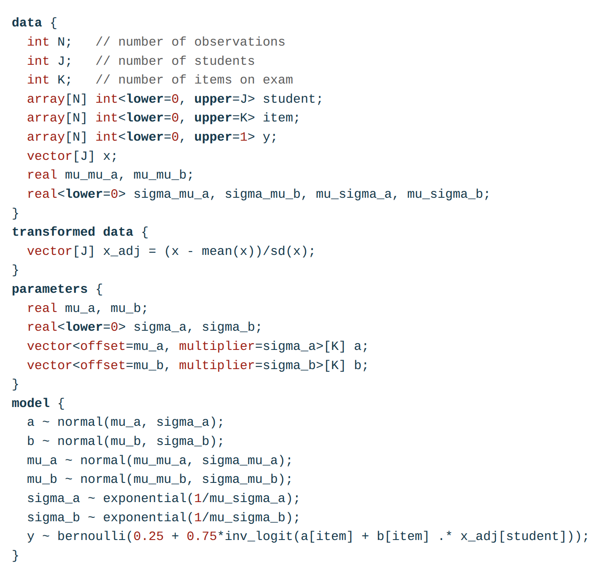

---
format:
  revealjs:
    output-file: 01-what-is-stan-slides.html
    incremental: true
---

# What is Stan?

Stan is...

- an [open-source community]{.hl} consisting of people from a variety of different backgrounds (Cognitive Science, Computer Science, Statistics, etc.).
- an [open-source ecosystem]{.hl} consisting of a core library, interfaces for multiple programming languages, and a growing collection of contributed packages.
- a [probabilistic programming language]{.hl} for specifying statistical models.

## An open-source community

We communicate via:

- [Slack](https://join.slack.com/t/mc-stan/shared_invite/zt-1le4ebi4m-UMtiOkJb4gcS16qz2wIYCw)
  + different channels (e.g., #general, #help)
  + mainly developer discussions
- [Discourse](https://discourse.mc-stan.org)
  + questions, discussion, and announcements related to Stan 
  + for both users and developers
- [GitHub](https://github.com/stan-dev)
  + code repositories
  + issue tracker for reporting bugs and requesting features
  + pull requests for contributing code, documentation, examples, etc.
- [Stan Website](https://mc-stan.org)
  + documentation, tutorials, case studies, etc.
  
## An open-source ecosystem

- multiple packages/libraries that work together to provide a complete probabilistic programming environment

{width="60%" fig-align="center" .nostretch}

More on this later!

## A probabilistic programming language

{width="60%" fig-align="center" .nostretch}