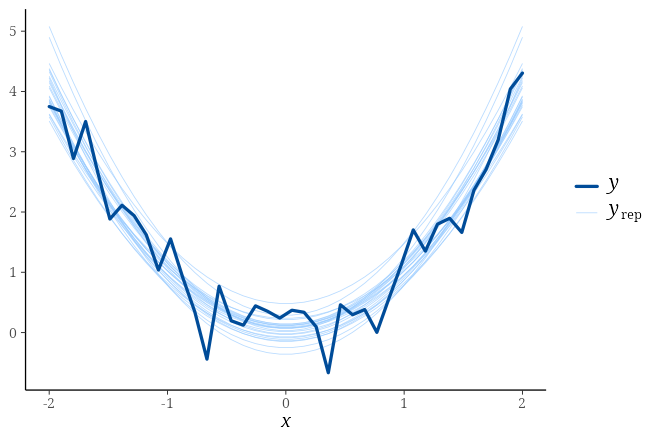

# Hands-on: a first contribution {#sec-hands-on}

The [checklist](05-checklist.qmd) tells you *what* the steps are. This chapter
walks through those steps four times on [real, currently-open
work]{.hl}, so you can see what each one actually looks like — including the
parts that go wrong.

Every command and every piece of output below was really run. Nothing is
illustrative pseudo-output.

::: {.callout-important}
## Nothing here was pushed to stan-dev or arviz-devs

These four changes were written and tested locally against real issues, but no
pull request was opened. If you would like to finish one of them and submit it
for real, please say so in the issue thread first — see
[Is somebody already working on it?](#sec-already-claimed) below.
:::

## The four tracks

Each track was chosen to expose a *different* kind of friction. The first is
walked end to end; the other three only show what changes.

| Track | Repository | The contribution | What it teaches |
| :-- | :-- | :-- | :-- |
| [1](#sec-track-posterior) | `stan-dev/posterior` | New exported function ([#238](https://github.com/stan-dev/posterior/issues/238)) | The full R workflow, and the documentation trap that ruins most first PRs |
| [2](#sec-track-bayesplot) | `stan-dev/bayesplot` | New plotting function ([#201](https://github.com/stan-dev/bayesplot/issues/201)) | Plot family conventions and `vdiffr` snapshot testing |
| [3](#sec-track-loo) | `stan-dev/loo` | New vignette section | Documentation-only changes, and vignettes that must not run on CRAN |
| [4](#sec-track-arviz) | `arviz-devs/arviz-stats` | New metric | The Python contrast: no `devtools`, layered architecture, generated changelog |

## Before you start (all four tracks)

### Is somebody already working on it? {#sec-already-claimed}

This is the step most new contributors skip, and it is the one that wastes the
most time. Read the *whole* issue thread, not just the title.

bayesplot [#201](https://github.com/stan-dev/bayesplot/issues/201) is a good
example. The issue asks for a new plotting function, and looks unclaimed. But
the last comment says:

> I have a [branch](https://github.com/stan-dev/bayesplot/tree/ppc-vs-predictors)
> for this that branches off of the new PPD module branch. So will wait on this
> until after #222.
>
> — @jgabry

So a maintainer started it. Before writing any code, check whether that is still
true:

```bash
# is the blocking issue resolved?
gh issue view 222 --repo stan-dev/bayesplot --json state,closedAt
```

``` {.text}
#222 Add new PPD module for plots without `y` variable — MERGED 2022-03-02T19:03:04Z
```

```bash
# has the branch moved since?
gh api repos/stan-dev/bayesplot/branches/ppc-vs-predictors \
  --jq '.name + " last commit: " + .commit.commit.author.date'
```

``` {.text}
ppc-vs-predictors last commit: 2020-06-16T18:24:04Z
```

The blocker was merged in 2022, and the branch has not been touched since 2020.
That makes it *reasonable to ask*, not automatically free to take. The right
move is a short comment on the issue:

> Hi! Is this still open? I see #222 has been merged and the `ppc-vs-predictors`
> branch hasn't changed since 2020. Happy to pick this up if the branch is
> stale — just let me know if you'd rather build on it.

Then wait for an answer before investing real work.

### Read the contributing guide

Every repository has one, and they are not identical.

```bash
gh repo view stan-dev/posterior --json name  # find the repo, then read:
# .github/CONTRIBUTING.md  (posterior, bayesplot)
# CONTRIBUTING.md          (arviz-stats)
```

posterior's is derived from the tidyverse guidelines and prescribes exactly the
`usethis` flow used below. arviz-stats' is three lines long and points at a
[central cross-repo guide](https://python.arviz.org/en/latest/contributing/index.html).

### Disclose AI assistance

If you used an AI assistant, write the PR description in your own words and say
what the assistant did. For the stan-dev R packages this is required: posterior,
bayesplot, loo, and cmdstanr all state that contributions must follow the
[Stan AI Contribution Policy](https://github.com/stan-dev/stan/wiki/AI-Contribution-Policy),
so read it before opening the PR. ArviZ has no equivalent policy and the Stan
one does not reach `arviz-devs`, so there disclosure is a recommendation rather
than a rule — a good one. Either way, you remain responsible for being able to
explain every line you submit.

---

## Track 1 — posterior: a new function {#sec-track-posterior}

**The issue:** [posterior #238](https://github.com/stan-dev/posterior/issues/238),
labelled `feature` and `good first issue`.

### Step 1: Mine the issue thread for the agreed design

The issue body is one sentence:

> It would be nice if there was a `summarise_draws()` helper function along the
> lines of `brms_summary_measures()`, which only returned the typical four
> **brms** summary columns for the mean, SD, and 95% intervals.

That is *not* enough to start coding. The design is in the comments, where the
maintainers converged on a signature:

> We could have something like
>
> ```r
> brms_summary_measures(robust = FALSE, names = "posterior")
> ```
>
> where `robust` decides on whether we use mean/sd or median/mad. And `names`
> could be either "brms" or "posterior". The reason I prefer "posterior" as
> default is that eventually in brms 3.0, brms names will be aligned with
> posterior names anyway.
>
> — @paul-buerkner

::: {.callout-tip}
## This is the single highest-value habit in this chapter

Implementing what the issue *title* says, instead of what the thread *agreed*,
is the most common reason a well-written PR gets sent back. Two maintainers
already discussed and rejected an alternative here (a `col_name` argument on
`summarise_draws()` itself). If you had not read the comments, you might have
built exactly the thing they turned down.
:::

### Step 2: Fork and clone

::: {.panel-tabset}
## usethis

```r
usethis::create_from_github("stan-dev/posterior", fork = TRUE)
```

## raw git

```bash
gh repo fork stan-dev/posterior --clone
cd posterior
```
:::

### Step 3: Set up the development environment

```r
devtools::install_dev_deps()
```

Then — before writing anything — check which version of **roxygen2** the project
uses. This one line prevents the most common unreviewable first PR:

```bash
grep -E "RoxygenNote|Config/roxygen2/version" DESCRIPTION
```

``` {.text}
RoxygenNote: 7.3.3
```

```r
packageVersion("roxygen2")
```

``` {.text}
[1] '8.0.0'
```

::: {.callout-warning}
## Mismatched roxygen2 rewrites every file in `man/`

roxygen2 8.x renamed the `RoxygenNote:` field to `Config/roxygen2/version:` and
changed how `\link{}` is written. If you run `devtools::document()` with the
wrong version, it silently reformats **every** `.Rd` file in the package.

Here is the same change documented with 8.0.0 and then with 7.3.3:

| | Files changed | Insertions |
| :-- | --: | --: |
| roxygen2 8.0.0 (mismatched) | 47 | 401 |
| roxygen2 7.3.3 (matching) | **4** | **106** |

The extra 43 files are pure noise like this, repeated hundreds of times:

``` diff
-Other diagnostics:
-\code{\link{ess_basic}()},
+Other diagnostics:
+\code{\link[=ess_basic]{ess_basic()}},
```

A reviewer cannot find your actual change in that. Install the matching version:

```r
remotes::install_version("roxygen2", version = "7.3.3")
```

Note that this is **per repository**. posterior pins 7.3.3; bayesplot pins
8.0.0. There is no single "R development setup" that is correct everywhere.
:::

### Step 4: Create a branch

```r
usethis::pr_init("238-brms-summary-measures")
```

### Step 5: Write the function

Put it next to its siblings. `default_summary_measures()`,
`default_convergence_measures()` and `default_mcse_measures()` all live in
`R/summarise_draws.R`, so the new function goes directly below them:

```r
#' @rdname draws_summary
#' @export
brms_summary_measures <- function(robust = FALSE, names = "posterior") {
  robust <- as_one_logical(robust)
  names <- match.arg(names, c("posterior", "brms"))
  point <- if (robust) "median" else "mean"
  spread <- if (robust) "mad" else "sd"
  if (names == "posterior") {
    out <- list(point, spread, ~quantile2(.x, probs = c(0.025, 0.975)))
    out <- stats::setNames(out, c(point, spread, "quantile2"))
  } else {
    out <- list(
      Estimate = point,
      Est.Error = spread,
      # quantile2() names its output after 'probs', so rename to match brms
      Q = ~stats::setNames(
        quantile2(.x, probs = c(0.025, 0.975)), c("Q2.5", "Q97.5")
      )
    )
  }
  out
}
```

Two things here came from reading the existing code rather than guessing:

* `as_one_logical()` is posterior's own internal validator (in `R/misc.R`). Using
  the project's helpers instead of `stopifnot()` is what "follow the style of the
  existing code" means in practice.
* Unlike its siblings, this function returns a **list**, not a character vector,
  because the 2.5%/97.5% quantiles need non-default arguments passed to
  `quantile2()`.

::: {.callout-note}
## A gotcha you only find by running it

The documentation for `summarise_draws()` says functions "can be specified in any
format supported by `as_function()`". True — but if you return a *list*, every
element must be named. This fails:

```r
list(mean = "mean", sd = "sd", ~quantile2(.x, probs = c(0.025, 0.975)))
```

``` {.text}
Error in do.call(funs[[m]], args) :
  'what' must be a function or character string
```

The reason is visible in the source. `summarise_draws.draws()` labels unnamed
arguments by deparsing the call:

```r
calls <- substitute(list(...))[-1]
calls <- ulapply(calls, deparse_pretty)
```

When you pass a single list, `calls` has length 1 while `funs` has length 3, so
the lookup for the unnamed third element runs off the end. Naming every element
avoids it entirely. Worth mentioning in your PR — it may deserve its own issue.
:::

### Step 6: Document it

Add the two new parameters to the shared roxygen block, extend the `@return`
section, and add examples. Then:

```r
devtools::document()
```

Check what that produced *before* committing:

```bash
git diff --stat
```

``` {.text}
 NAMESPACE                             |  1 +
 R/summarise_draws.R                   | 42 +++++++++++++++++++++++++++++++++++
 man/draws_summary.Rd                  | 24 ++++++++++++++++++++
 tests/testthat/test-summarise_draws.R | 39 ++++++++++++++++++++++++++++++++
 4 files changed, 106 insertions(+)
```

Four files. That is what a reviewable PR looks like. The export appeared
automatically:

``` diff
 export(bind_draws)
+export(brms_summary_measures)
 export(cdf)
```

### Step 7: Test it

Tests go in the matching file, `tests/testthat/test-summarise_draws.R`:

```r
test_that("brms_summary_measures works correctly", {
  x <- as_draws_df(example_draws())

  sum_x <- summarise_draws(x, brms_summary_measures())
  expect_equal(names(sum_x), c("variable", "mean", "sd", "q2.5", "q97.5"))
  expect_equal(mean(x$mu), as.numeric(sum_x$mean[sum_x$variable == "mu"]))

  sum_x <- summarise_draws(x, brms_summary_measures(robust = TRUE))
  expect_equal(names(sum_x), c("variable", "median", "mad", "q2.5", "q97.5"))

  sum_x <- summarise_draws(x, brms_summary_measures(names = "brms"))
  expect_equal(
    names(sum_x), c("variable", "Estimate", "Est.Error", "Q2.5", "Q97.5")
  )
})

test_that("brms_summary_measures errors on invalid input", {
  expect_error(brms_summary_measures(names = "rstanarm"), "should be one of")
  expect_error(brms_summary_measures(robust = "yes"))
})
```

Test the failure modes, not just the happy path. Then run the whole suite —
not only your file, because your change can break something else:

```r
devtools::test()
```

``` {.text}
[ FAIL 0 | WARN 0 | SKIP 11 | PASS 2040 ]
```

And confirm the behaviour is what the issue asked for:

```r
x <- example_draws("eight_schools")
summarise_draws(x, brms_summary_measures())
```

``` {.text}
# A tibble: 10 × 5
   variable  mean    sd    q2.5 q97.5
   <chr>    <dbl> <dbl>   <dbl> <dbl>
 1 mu        4.18  3.40  -2.16   10.2
 2 tau       4.16  3.58   0.174  14.6
 3 theta[1]  6.75  6.30  -2.81   22.7
 4 theta[2]  5.25  4.63  -3.24   14.9
 5 theta[3]  3.04  6.80 -15.0    13.2
 6 theta[4]  4.86  4.92  -4.64   14.8
 7 theta[5]  3.22  5.08  -8.68   12.3
 8 theta[6]  3.99  5.16  -6.80   12.8
 9 theta[7]  6.50  5.26  -2.57   18.1
10 theta[8]  4.57  5.25  -6.53   14.8
```

```r
summarise_draws(x, brms_summary_measures(names = "brms"))
```

``` {.text}
# A tibble: 10 × 5
   variable Estimate Est.Error    Q2.5 Q97.5
   <chr>       <dbl>     <dbl>   <dbl> <dbl>
 1 mu           4.18      3.40  -2.16   10.2
 2 tau          4.16      3.58   0.174  14.6
 3 theta[1]     6.75      6.30  -2.81   22.7
 ...
```

### Step 8: Update `NEWS.md`

Add a bullet under a development-version heading, matching the file's existing
tone:

``` {.markdown}
# posterior (development version)

### Enhancements

* Add `brms_summary_measures()`, a helper for `summarise_draws()` that returns
the summary measures used by the **brms** package, with `robust` and `names`
arguments to select mean/sd vs. median/mad and posterior vs. brms column
names. (#238)
```

::: {.callout-note}
`NEWS.md` is markdown, not Rd. `\pkg{brms}` is valid in a `.Rd` file and wrong
here — use `**brms**`.
:::

### Step 9: Check, commit, push

```r
devtools::check()
```

```bash
git add R/ man/ NAMESPACE tests/ NEWS.md
git commit -m "feat: add brms_summary_measures() helper for summarise_draws()"
```

```r
usethis::pr_push()
```

### Step 10: Write the pull request

Following the structure from [How to write a good PR
description](03-how-to-contribute.qmd#sec-contributing-code):

::: {.callout-note}
## Worked PR description

**Title:** `Add brms_summary_measures() helper for summarise_draws()`

**Body:**

Closes #238.

**Description**

Adds `brms_summary_measures()`, which returns the summary measures used by the
brms summary output so they can be passed to `summarise_draws()`. It follows the
signature agreed in the issue thread, `brms_summary_measures(robust = FALSE,
names = "posterior")`, where `robust` selects mean/sd vs. median/mad and `names`
selects posterior-style (`mean`, `sd`, `q2.5`, `q97.5`) vs. brms-style
(`Estimate`, `Est.Error`, `Q2.5`, `Q97.5`) column names.

Unlike the neighbouring `default_*_measures()` functions it returns a named list
rather than a character vector, because the 2.5%/97.5% quantiles need arguments
passed to `quantile2()`.

**Breaking changes**

None. This only adds a new exported function.

**Tests**

Added `test_that("brms_summary_measures works correctly")` and an input
validation test to `tests/testthat/test-summarise_draws.R`, covering all four
combinations of `robust` and `names`. `devtools::test()` passes
(0 failures, 2040 passing).

**Documentation**

Documented under the existing `draws_summary` topic alongside the
`default_*_measures()` functions, with examples. `NEWS.md` updated.

**Open questions**

* Every element of the returned list has to be named, otherwise
  `summarise_draws()` errors with `'what' must be a function or character
  string` — the `calls <- substitute(list(...))[-1]` lookup indexes past the end
  for unnamed elements. Should I open a separate issue for that?
* I kept `names = "posterior"` as the default, per the discussion in the thread.
:::

---

## Track 2 — bayesplot: a new plotting function {#sec-track-bayesplot}

**The issue:** [bayesplot #201](https://github.com/stan-dev/bayesplot/issues/201),
`ppc_curve_overlay()` — like `ppc_ribbon()` but drawing the raw draws instead of
interval summaries. (Remember from
[above](#sec-already-claimed): ask in the thread first.)

Steps 2–4 and 8–10 are identical to Track 1. Here is what differs.

### Different: check the roxygen2 pin again

```bash
grep -E "RoxygenNote|Config/roxygen2/version" DESCRIPTION
```

``` {.text}
Config/roxygen2/version: 8.0.0
```

bayesplot pins **8.0.0**; posterior pins **7.3.3**. Same organisation, same
language, different requirement.

### Different: plot families are a file, a topic, and a `_data()` twin

bayesplot groups plots into families. A new family means a new file
`R/ppc-curves.R` with a shared documentation block:

```r
#' PPC curves
#'
#' @name PPC-curves
#' @family PPCs
#'
#' @template args-y-yrep
#' @template return-ggplot-or-data
```

Note `@template` — bayesplot keeps reusable roxygen fragments in `man-roxygen/`
so argument documentation stays consistent across dozens of functions. Do not
retype an argument description that already has a template.

Nearly every plotting function has a `*_data()` companion that returns the data
frame the plot is built from, and it must be exported too:

```r
#' @rdname PPC-curves
#' @export
ppc_curve_overlay_data <- function(y, yrep, x = NULL, ...) {
  check_ignored_arguments(...)

  y <- validate_y(y)
  yrep <- validate_predictions(yrep, length(y))
  x <- validate_x(x, y)

  data <- ppc_data(y, yrep)
  data$x_value <- x[data$y_id]
  # lines are drawn in row order, so sort within each draw
  dplyr::arrange(data, .data$rep_id, .data$x_value)
}
```

Registration into `available_ppc()` is automatic — it greps the namespace
exports — but only *after* you run `devtools::document()`:

```r
available_ppc()  # before document(): FALSE
"ppc_curve_overlay" %in% available_ppc()
```

``` {.text}
[1] TRUE
```

### Different: telling good documentation churn from bad

Track 1 taught you to be suspicious of a large `man/` diff. Here it is
legitimate:

``` {.text}
 NAMESPACE                  | 2 ++
 man/PPC-calibration.Rd     | 3 ++-
 man/PPC-censoring.Rd       | 3 ++-
 man/PPC-distributions.Rd   | 3 ++-
 ... 10 PPC-*.Rd files total
```

Because the new topic declares `@family PPCs`, every other family member's
"Other PPCs:" list gains an entry:

``` diff
 \code{\link{PPC-censoring}},
+\code{\link{PPC-curves}},
 \code{\link{PPC-discrete}},
```

That is *correct* and must be committed. The test is whether the change is
explainable: family cross-references, yes; hundreds of `\link` reformattings,
no.

### Different: `vdiffr` visual regression tests

This is the part unique to bayesplot. Plots are compared against stored SVG
snapshots:

```r
test_that("ppc_curve_overlay renders correctly", {
  testthat::skip_on_cran()
  testthat::skip_if_not_installed("vdiffr")
  skip_on_r_oldrel()

  p_base <- ppc_curve_overlay(vdiff_y, vdiff_yrep)
  vdiffr::expect_doppelganger("ppc_curve_overlay (default)", p_base)
})
```

::: {.callout-warning}
## Your visual tests will silently skip

Run the file directly and the snapshot tests never execute:

```r
testthat::test_file("tests/testthat/test-ppc-curves.R")
```

``` {.text}
SKIP: 'test-ppc-curves.R:52:3' -- Reason: On CRAN

[ FAIL 0 | WARN 0 | SKIP 1 | PASS 17 ]
```

`skip_on_cran()` skips unless the `NOT_CRAN` environment variable is set.
`devtools::test()` sets it for you; calling `testthat` directly does not. Set it
yourself — this form works on every platform, from the R console you already have
open:

```r
withr::with_envvar(c(NOT_CRAN = "true"), {
  devtools::load_all()
  testthat::test_file("tests/testthat/test-ppc-curves.R")
})
```

The shell equivalent is shorter, but `VAR=value command` is POSIX syntax: it
works in Terminal and in Git Bash, not in PowerShell or `cmd.exe`.

```bash
NOT_CRAN=true Rscript -e 'devtools::load_all(); testthat::test_file("tests/testthat/test-ppc-curves.R")'
```

``` {.text}
WARNING: Adding new file snapshot: 'tests/testthat/_snaps/ppc-curves/ppc-curve-overlay-default.svg'
WARNING: Adding new file snapshot: 'tests/testthat/_snaps/ppc-curves/ppc-curve-overlay-x-values.svg'
WARNING: Adding new file snapshot: 'tests/testthat/_snaps/ppc-curves/ppc-curve-overlay-y-as-both.svg'
WARNING: Adding new file snapshot: 'tests/testthat/_snaps/ppc-curves/ppc-curve-overlay-y-as-points.svg'

[ FAIL 0 | WARN 4 | SKIP 0 | PASS 21 ]
```

21 passing instead of 17, and four SVGs written. Those SVGs **are part of your
PR** — commit them.
:::

For a *new* plot the snapshots are created and the warning is expected. When you
*change* an existing plot, review the diff before accepting it:

```r
testthat::snapshot_review()
```

This opens a Shiny app showing old vs. new side by side. Only accept a change
that is the one you intended.

### Different: look at your plot

Tests confirm a `ggplot` object comes back. They do not confirm it is sensible.
The first version of the example in the documentation used

```r
yrep <- t(sapply(1:25, function(i) rnorm(1, x^2, 0.1) + x^2))
```

which centres `yrep` on `2x²` — the draws floated far above `y`, and every test
still passed. Rendering it once caught it immediately:

{fig-alt="Overlaid light blue predictive curves following a parabola, with a darker observed data line" width="70%" fig-align="center" .nostretch}

---

## Track 3 — loo: a vignette section {#sec-track-loo}

**The change:** `vignettes/loo2-example.Rmd` has a section *Plotting Pareto
$k$ diagnostics*, but never tells the reader what to *do* when the values are
too high.

Documentation contributions are the easiest way to start, and this is what makes
them different.

### Different: no NAMESPACE, no tests, no `document()`

A vignette change touches `vignettes/*.Rmd` and nothing else. There is no
exported object, so `devtools::document()` is not needed, and there is no unit
test to write. The review is about correctness and clarity of prose.

### Different: vignettes must not run on CRAN

loo's vignettes fit real models, which is far too slow for CRAN. They are
guarded in the YAML header:

``` {.yaml}
params:
  EVAL: !r identical(Sys.getenv("NOT_CRAN"), "true")
```

and in a shared knitr child file:

```r
opts_chunk$set(
  eval = if (isTRUE(exists("params"))) params$EVAL else FALSE,
  ...
)
```

So **every chunk is `eval = FALSE` unless `NOT_CRAN=true`**. If you render
normally, your new chunk produces no output and you have verified nothing. From
the R console, on any platform:

```r
withr::with_envvar(c(NOT_CRAN = "true"), {
  rmarkdown::render("vignettes/loo2-example.Rmd")
})
```

Or, in a POSIX shell (Terminal, or Git Bash on Windows):

```bash
NOT_CRAN=true Rscript -e 'rmarkdown::render("vignettes/loo2-example.Rmd")'
```

``` {.text}
...
24/33 [loo2]
26/33 [plot-loo2]
28/33 [reloo]
33/33
Output created: loo2-example.html
```

Note that this refits every model in the vignette — it takes minutes, not
seconds. Budget for it.

### Different: write against what the reader can already see

The new section reuses the `loo1` object the vignette already computed, so it
costs nothing to run and stays consistent with the surrounding text:

``` {.markdown}
### What to do when the Pareto $k$ estimates are too high

A high $k$ value tells us that the importance sampling approximation is
unreliable for that observation. It does not by itself tell us *why*, and the
appropriate remedy is different in the two common cases.

**First compare `p_loo` to the number of parameters in the model.** ...

**If `p_loo` is reasonable and only a few observations have high $k$**, ...
The observations in question can be identified with `pareto_k_ids()`:
```

````
```{{r pareto-k-ids}}
pareto_k_ids(loo1, threshold = 0.7)
```
````

which renders to real output:

``` {.text}
 [1]  14  16  30  38  56  63  68  72  77  93 122 130 207 222 230 241 261
```

followed by the remedies in increasing order of cost — more draws, moment
matching, mixture importance sampling, then `kfold()` — each linking to the
vignette that covers it.

::: {.callout-tip}
## Verify every function and link you mention

Draft prose is where invented APIs creep in. Check before you write:

```bash
grep -oE "^export\([^)]*\)" NAMESPACE | grep -iE "kfold|moment|pareto"
```

``` {.text}
export(kfold)
export(loo_moment_match)
export(pareto_k_ids)
export(pareto_k_influence_values)
export(pareto_k_table)
export(pareto_k_values)
```

While drafting this section, a plausible-sounding `loo_mixis()` turned out not
to exist — the mixture-IS vignette does not export a function by that name. The
text links the vignette by title instead.
:::

### Same: `NEWS.md`

Some projects skip changelog entries for documentation. loo does not — its
`NEWS.md` mentions vignettes repeatedly, so add one:

``` {.markdown}
* Add a section to the _Using the loo package_ vignette describing what to do
when the Pareto $k$ estimates are too high, covering `pareto_k_ids()`, moment
matching, mixture importance sampling, and `kfold()`.
```

loo's convention includes attribution — `by @username in #PR` — which you can
fill in once the PR number exists.

---

## Track 4 — arviz-stats: the Python contrast {#sec-track-arviz}

**The change:** add the Brier score to `metrics()`, mirroring `measure_brier` on
loo's `pred_measure` branch.

### Different: which repository?

ArviZ is no longer one package. The modular stack splits into three, and picking
the wrong one wastes a round of review:

| Repository | Holds | Your change goes here if… |
| :-- | :-- | :-- |
| `arviz-base` | data structures, `DataTree`/`InferenceData`, converters | you are changing how data is *represented* |
| `arviz-stats` | statistics, diagnostics, LOO, metrics | you are computing a *number* |
| `arviz-plots` | plots, multi-backend rendering | you are drawing something |

This mirrors the "which stan-dev repository?" question from
[The Stan ecosystem](02-stan-ecosystem.qmd). A new metric is a number, so:
`arviz-stats`.

::: {.callout-tip}
## Check it does not already exist — under another name

Two obvious candidates for this track turned out to be already implemented:

* **CRPS** exists as `loo_score(kind="crps" | "scrps")`
* **R²** exists as `bayesian_r2()` and `residual_r2()`

Neither appears under the name you would first grep for. Searching the whole
source tree, not just the public API listing, is worth the minute it takes.
:::

### Different: no `devtools` — a virtual environment and an editable install

```bash
gh repo fork arviz-devs/arviz-stats --clone
cd arviz-stats
python3 -m venv .venv
source .venv/bin/activate
pip install -e ".[test]"
```

On Windows the interpreter is `python` (or `py -3`), and `venv` writes
`Scripts\` where macOS and Linux write `bin/`: `python -m venv .venv` then
`.venv\Scripts\Activate.ps1` in PowerShell, or
`source .venv/Scripts/activate` in Git Bash. Everything after the activation
line is identical on all three platforms.

`arviz-stats` itself only needs `numpy` and `scipy`, so this is quick. Its
sibling `arviz-plots` is not: it declares the other two as **git**
dependencies, so `pip install -e` pulls development versions straight from
GitHub rather than PyPI.

``` {.toml filename="arviz-plots/pyproject.toml"}
dependencies = [
  "arviz-base @ git+https://github.com/arviz-devs/arviz-base",
  "arviz-stats[xarray] @ git+https://github.com/arviz-devs/arviz-stats",
]
```

That matters if your change spans repositories — a new statistic in
`arviz-stats` that you also want to plot, say. In that case clone both and
install both editable, in dependency order, so `arviz-plots` uses your local
`arviz-stats` instead of downloading a fresh copy from GitHub:

```bash
pip install -e ./arviz-stats
pip install -e ./arviz-plots --no-deps
```

### Different: the change spans architectural layers

R packages are flat: one file in `R/`, one entry in `NAMESPACE`. arviz-stats is
layered, and a new metric touches each layer in turn.

The computation goes in the array layer, next to `_mae`, `_mse` and `_acc`:

``` {.python filename="src/arviz_stats/base/diagnostics.py"}
@staticmethod
def _brier(observed, predicted):
    """Compute the Brier score.

    Parameters
    ----------
    observed: array-like of shape = (n_outputs,)
        Ground truth (correct) target values, coded as 0 or 1.
    predicted: array-like of shape = (n_outputs)
        Predicted probabilities of the outcome being 1.

    Returns
    -------
    mean: float
        Brier score. Lower values indicate better calibrated predictions.
    std_error: float
        Standard error of the Brier score.
    """
    n_obs = len(observed)
    sq_e = (predicted - observed) ** 2
    mean = np.mean(sq_e)
    std_error = np.std(sq_e) / n_obs**0.5
    return mean, std_error
```

Dispatch is by name — `getattr(self, f"_{kind}")` — so no registration is
needed, only validation and documentation in the public layer:

``` {.python filename="src/arviz_stats/metrics.py"}
-    valid_kind = ["mae", "rmse", "mse", "acc", "acc_balanced"]
+    valid_kind = ["mae", "rmse", "mse", "acc", "acc_balanced", "brier"]
```

Docstrings follow **numpydoc**, and the `kind` list is duplicated in the public
`metrics()` and the private `_metrics()` — both must be updated.

### Different: `pytest`, and computing your expected values

Tests are parametrised, using a shared fixture:

``` {.python filename="tests/test_metrics.py"}
@pytest.mark.parametrize(
    "kind, round_to, expected_mean, expected_se",
    [
        ("acc", 2, 0.43, 0.19),
        ("acc_balanced", "2g", 0.46, 0.039),
        ("brier", "2g", 0.26, 0.0094),
    ],
)
def test_metrics_acc(datatree_binary, kind, round_to, expected_mean, expected_se):
```

Do not invent the expected numbers. Compute them from the same fixture the test
uses, then paste them in:

```python
import arviz_base as azb
from arviz_stats import metrics

dt = azb.testing.datatree_binary()
print(metrics(dt, kind="brier", round_to="None"))
```

``` {.text}
brier(mean=0.25816517857142857, se=0.009401121759314401)
```

```bash
pytest tests/test_metrics.py -q
```

``` {.text}
............................................                             [100%]
44 passed in 1.67s
```

### Different: linting is enforced, and pinned by hash

R packages check style informally. ArviZ runs **ruff** and **pylint** as
pre-commit hooks, pinned to exact commit hashes:

``` {.yaml}
- repo: https://github.com/astral-sh/ruff-pre-commit
  rev: 2700fd5671c633760d912769c041bfcde2b9a01b  # frozen: v0.15.22
  hooks:
    - id: ruff-check
      args: [ --fix, --exit-non-zero-on-fix ]
    - id: ruff-format
```

Install the hooks so CI does not fail on formatting:

```bash
pip install pre-commit && pre-commit install
pre-commit run --all-files
```

or run the tools directly:

```bash
ruff check src/ tests/ && ruff format --check src/ tests/
```

``` {.text}
All checks passed!
3 files already formatted
```

Note also `no-commit-to-branch --branch main` in the hook config: the repository
will physically refuse a commit on `main`. Branch first.

### Different: do **not** edit the changelog

::: {.callout-important}
`CHANGELOG.md` in arviz-stats is generated at release time from merged pull
request titles:

``` {.markdown}
### New Features
* Add moment matching arg to main `loo()` function by [@jordandeklerk](...) in [#386](...)
```

There is no "unreleased" section to append to. Editing it by hand creates a
conflict at the next release.

**Your PR title becomes the changelog entry**, so it carries the weight that
`NEWS.md` carries in the R packages. Write it accordingly:

* Good: `Add Brier score to metrics()`
* Avoid: `update metrics`
:::

### The result

``` {.text}
 src/arviz_stats/base/diagnostics.py | 24 ++++++++++++++++++++++++
 src/arviz_stats/metrics.py          |  7 +++++--
 tests/test_metrics.py               |  1 +
 3 files changed, 30 insertions(+), 2 deletions(-)
```

---

## Side by side {#sec-side-by-side}

The same conceptual contribution — "add a summary measure" — in both ecosystems:

| | R (posterior) | Python (arviz-stats) |
| :-- | :-- | :-- |
| Fork & clone | `usethis::create_from_github(fork = TRUE)` | `gh repo fork --clone` |
| Environment | `devtools::install_dev_deps()` | `python -m venv` + `pip install -e ".[test]"` |
| Pinned tooling | roxygen2 version in `DESCRIPTION` | ruff/pylint hashes in `.pre-commit-config.yaml` |
| Where code goes | one file in `R/` | array layer + public layer |
| Export | `@export` → `devtools::document()` → `NAMESPACE` | `getattr` dispatch, no registration |
| Docs | roxygen2 comments → `man/*.Rd` | numpydoc docstrings |
| Tests | `testthat` (+ `vdiffr` for plots) | `pytest`, parametrised |
| Run tests | `devtools::test()` | `pytest` |
| Full check | `devtools::check()` | `tox` / CI |
| Style | conventional, reviewed by humans | enforced by pre-commit |
| Changelog | edit `NEWS.md` yourself | **generated from your PR title** |

## Things that went wrong while writing this chapter {#sec-what-went-wrong}

Every one of these cost time, and all are ordinary:

1. **Picked a contribution that should not exist.** The first posterior candidate
   was `mcse_var()`. Variance is `sd²`, so it is derivable from the existing
   `mcse_sd()` — a reviewer would rightly close it. *Ask whether the change is
   wanted before asking whether it is correct.*

2. **Picked a "gap" that was a deliberate design.** The first bayesplot
   candidate was `ppc_scatter_avg_vs_x()`, apparently missing next to
   `ppc_error_scatter_avg_vs_x()`. It is missing because the maintainers
   consolidated those variants into an `x` argument, and the remaining one is
   deprecated. *An asymmetry in an API is often a decision, not an oversight.*

3. **Ran `document()` with the wrong roxygen2.** 47 files changed instead of 4.

4. **Wrote a plot example that was numerically wrong** but passed every test.

5. **Chased a bug too deep for its purpose.** An earlier ArviZ candidate was a
   rendering bug where a rug plot appears in matplotlib but not plotly. The
   cause turned out to involve plotly's open-marker size semantics *and* its
   default outline width of zero — a genuine bug, but the fix teaches plotly
   internals, not how to contribute. *Scope your first contribution so the
   workflow is the hard part, not the domain.*

6. **Proposed things that already existed.** CRPS and R² are both already in
   arviz-stats, under names you would not grep for first.

::: {.callout-tip}
## If you take one thing from this chapter

The mechanics — fork, branch, test, push — are the easy part and you will learn
them in an afternoon. The hard parts are choosing something that is genuinely
wanted, reading the issue thread properly, and keeping the diff small enough
that somebody can review it.
:::
